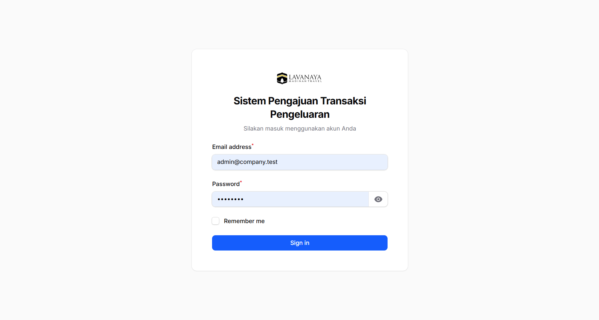
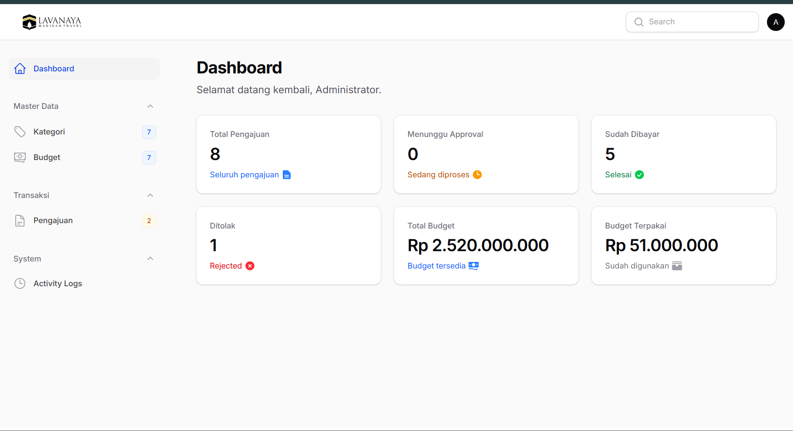
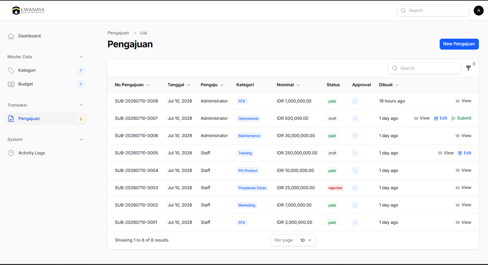
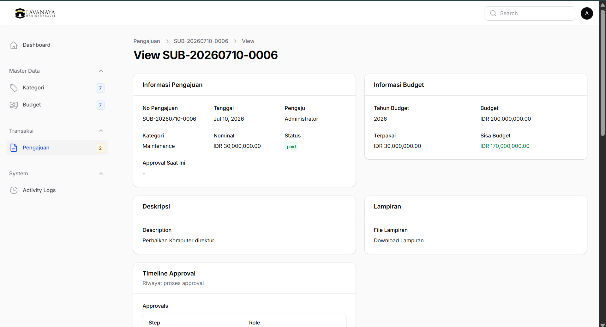
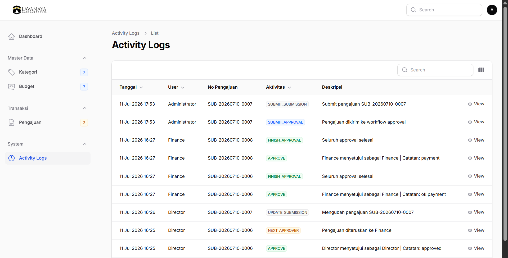

# Sistem Pengajuan Transaksi Pengeluaran

Aplikasi **Sistem Pengajuan Transaksi Pengeluaran** merupakan aplikasi berbasis **Laravel 13** dan **Filament 4** yang digunakan untuk mengelola proses pengajuan biaya perusahaan secara digital, mulai dari pembuatan pengajuan, workflow approval bertingkat, pembayaran, monitoring budget, dashboard KPI hingga audit activity log.

# Screenshot

## Login



---

## Dashboard



---

## Daftar Pengajuan



---

## Detail Pengajuan



---

## Activity Log




---

# Tech Stack

- PHP 8.3+
- Laravel 13
- Filament 4
- Livewire
- MySQL
- Spatie Laravel Permission
- Vite
- Laragon (Development Environment)

---

# Fitur

## Authentication

- Login Administrator
- Role Based Access Control (RBAC)
- Administrator
- Staff
- Supervisor
- Manager
- Director
- Finance

---

## Master Data

### Kategori

- CRUD Kategori
- Support Purchase Order
- Deskripsi Kategori

### Budget

- Budget Tahunan
- Budget per Kategori
- Total Budget
- Budget Terpakai
- Sisa Budget

---

## Pengajuan Transaksi

- Create Draft
- Edit Draft
- Delete Draft
- Submit Pengajuan
- Upload Lampiran
- Download Lampiran
- Auto Generate Nomor Pengajuan

Contoh nomor pengajuan:

```
SUB-20260710-0001
```

---

## Workflow Approval

Workflow approval ditentukan secara otomatis berdasarkan nominal pengajuan.

### Non Purchase Order

| Nominal | Workflow |
|----------|-----------|
| ≤ Rp5.000.000 | Supervisor → Finance |
| > Rp5.000.000 | Supervisor → Manager → Finance |
| > Rp10.000.000 | Supervisor → Manager → Director → Finance |

### Purchase Order

```
Director
↓
Finance
```

---

## Payment

Setelah seluruh approval selesai maka sistem akan:

- Membuat data Payment otomatis
- Mengurangi Budget secara otomatis
- Mengubah status menjadi Paid
- Mencatat Activity Log

---

## Dashboard KPI

Dashboard menampilkan informasi secara real-time:

- Total Pengajuan
- Menunggu Approval
- Sudah Dibayar
- Ditolak
- Total Budget
- Budget Terpakai

---

## Activity Log

Seluruh aktivitas sistem akan dicatat secara otomatis.

Contoh aktivitas:

- CREATE_SUBMISSION
- SUBMIT_SUBMISSION
- SUBMIT_APPROVAL
- APPROVE
- NEXT_APPROVER
- REJECT
- FINISH_APPROVAL
- CREATE_PAYMENT
- PAYMENT_SUCCESS

Setiap log menyimpan:

- User
- Nomor Pengajuan
- Aktivitas
- Deskripsi
- IP Address
- Waktu Aktivitas

---

# Business Rules

Beberapa aturan bisnis yang diterapkan pada aplikasi:

- Pengajuan hanya dapat diedit ketika masih berstatus Draft.
- Pengajuan hanya dapat dihapus ketika masih Draft.
- Budget harus tersedia sebelum pengajuan dikirim.
- Workflow approval ditentukan otomatis berdasarkan nominal pengajuan.
- Purchase Order memiliki workflow approval yang berbeda.
- Setelah approval Finance selesai maka Payment dibuat otomatis.
- Budget akan otomatis berkurang setelah pembayaran berhasil.
- Seluruh aktivitas sistem dicatat pada Activity Log.

---

# Struktur Project

```
app/
├── Filament/
│   ├── Resources/
│   ├── Widgets/
│   └── Pages/
│
├── Models/
│
├── Services/
│   ├── SubmissionService.php
│   ├── ApprovalService.php
│   ├── BudgetService.php
│   ├── PaymentService.php
│   └── ActivityLogService.php
│
└── Providers/

database/
├── migrations/
└── seeders/

public/
resources/
storage/
```

---

# Instalasi

## Prasyarat

Pastikan environment berikut telah tersedia:

- PHP 8.3+
- Composer
- Node.js & NPM
- MySQL
- Laragon (direkomendasikan) atau web server lain yang mendukung Laravel

---

## Clone Repository

```bash
git clone https://github.com/think29/pengajuan-transaksi.git
```

Masuk ke folder project

```bash
cd pengajuan-transaksi
```

---

## Install Dependency

```bash
composer install
```

Install Node Module

```bash
npm install
```

---

## Konfigurasi Environment

Copy file environment

```bash
cp .env.example .env
```

Generate application key

```bash
php artisan key:generate
```

Konfigurasi database pada file `.env`

```env
APP_NAME="Sistem Pengajuan Transaksi Pengeluaran"
APP_URL=http://127.0.0.1:8000

DB_CONNECTION=mysql
DB_HOST=127.0.0.1
DB_PORT=3306
DB_DATABASE=pengajuan_transaksi
DB_USERNAME=root
DB_PASSWORD=
```

---

## Jalankan Migration

```bash
php artisan migrate
```

---

## Jalankan Seeder

```bash
php artisan db:seed
```

---

## Storage Link

```bash
php artisan storage:link
```

---

## Build Asset

Production

```bash
npm run build
```

atau selama development

```bash
npm run dev
```

---

## Jalankan Aplikasi

```bash
php artisan serve
```

Aplikasi dapat diakses melalui

```
http://127.0.0.1:8000/admin
```

---

# Default Login

| Role | Email | Password |
|------|-------|----------|
| Administrator | admin@company.test | password |
| Staff | staff@company.test | password |
| Supervisor | spv@company.test | password |
| Manager | manager@company.test | password |
| Director | director@company.test | password |
| Finance | finance@company.test | password |

---

# Arsitektur Aplikasi

Business Logic dipisahkan menggunakan **Service Layer** agar:

- lebih mudah dipelihara
- reusable
- mengikuti prinsip Single Responsibility
- meminimalkan logic pada Filament Resource
- memudahkan proses testing

Service yang digunakan:

- SubmissionService
- ApprovalService
- BudgetService
- PaymentService
- ActivityLogService

---

# Workflow Sistem

```
Draft

↓

Submit Pengajuan

↓

Supervisor

↓

Manager

↓

Director

↓

Finance

↓

Payment

↓

Paid
```

---

# Audit Trail

Setiap aktivitas penting pada sistem akan dicatat secara otomatis, meliputi:

- User
- Nomor Pengajuan
- Aktivitas
- Deskripsi
- IP Address
- Timestamp

Hal ini memudahkan proses monitoring serta audit terhadap seluruh transaksi yang terjadi pada sistem.

---

# Deliverables

Project ini terdiri dari:

- Source Code Laravel
- Database Migration
- Database Seeder
- Dashboard KPI
- Workflow Approval
- Activity Log
- README.md

---

# Development Notes

Project dikembangkan menggunakan:

- Laravel 13
- Filament 4
- Service Layer Architecture
- Spatie Laravel Permission
- MySQL Database
- KPI Dashboard
- Activity Logging
- Multi Level Approval Workflow

---

# Author

**Ayik Mardiansah**

Tes Praktik IT Developer

Laravel 13 + Filament 4

Copyright © 2026
